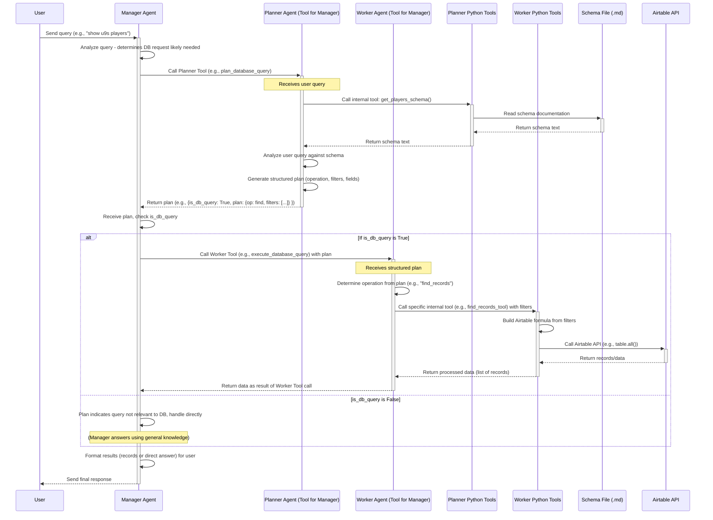

# Low-Level Design: Three-Agent Airtable Query System

## 1. Introduction & Context

This document outlines the low-level design for a multi-agent system capable of handling natural language queries from a user to retrieve data from an Airtable database. The system aims to provide a conversational interface for accessing structured data, specifically player information stored in Airtable. It employs a three-agent pattern (Manager, Planner, Worker) to break down the task into manageable steps: understanding the query, planning the data retrieval, and executing the plan against the Airtable API.

## 2. Architecture Overview

The system utilizes a Manager-Worker pattern, where the Manager Agent acts as the primary orchestrator and user interface. The Manager delegates specific sub-tasks to specialized "tool agents": a Planner Agent and a Worker Agent.

-   **Manager Agent:** The central point of contact for the user. It decides which tool (Planner or Worker) is appropriate based on the user query and the current state.
-   **Planner Agent (Tool):** Responsible for analyzing the user's query in the context of the available database schema and generating a structured plan for data retrieval.
-   **Worker Agent (Tool):** Responsible for executing the structured plan provided by the Planner Agent, interacting with the actual data source (Airtable) via specific Python tools.



## 3. Agent Descriptions

### 3.1. Manager Agent

-   **Role:** Orchestrator and User Interface.
-   **Responsibilities:**
    -   Receives the natural language query from the User.
    -   Analyzes the query to determine the likely intent (e.g., requires database access vs. general question).
    -   Calls the `PlannerAgent` tool to generate a query plan if database access seems necessary.
    -   Evaluates the plan received from the `PlannerAgent`.
    -   If the plan indicates a database query (`is_db_query: True`), calls the `WorkerAgent` tool with the structured plan.
    -   If the plan indicates no database query (`is_db_query: False`), handles the query directly using its own capabilities (potentially answering general questions or stating inability to answer).
    -   Receives results (data records or confirmation) from the `WorkerAgent`.
    -   Formats the final response (either the retrieved data or a direct answer) for the User.
-   **Tools:** `PlannerAgent`, `WorkerAgent`.

### 3.2. Planner Agent (Tool for Manager)

-   **Role:** Query Analysis and Database Interaction Planning.
-   **Inputs:** User's natural language query (passed from Manager).
-   **Outputs:** A structured plan object. Example structure:
    ```json
    {
      "is_db_query": true,
      "plan": {
        "operation": "find", // e.g., find, count, aggregate
        "table": "Players", // Target table inferred from schema/query
        "filters": [ // List of filter conditions
          {"field": "Age Group", "operator": "=", "value": "U9"}
        ],
        "fields": ["Player Name", "Team", "Age Group"] // Optional: fields to retrieve
      }
    }
    // Or for non-DB queries:
    {
      "is_db_query": false,
      "plan": null
    }
    ```
-   **Internal Tools:** `PlannerTools` (e.g., `get_players_schema`).
-   **Dependencies:** `SchemaFile` (accessed via `PlannerTools`).
-   **Responsibilities:**
    -   Retrieves the relevant database schema information using `PlannerTools`.
    -   Analyzes the user query against the schema to understand entities, attributes, and filter conditions.
    -   Determines if the query relates to the database (`is_db_query`).
    -   If it's a database query, constructs a structured `plan` detailing the required operation, target table, filters, and potentially fields to select.
    -   Returns the plan object to the Manager Agent.

### 3.3. Worker Agent (Tool for Manager)

-   **Role:** Database Plan Execution.
-   **Inputs:** Structured `plan` object (received from Manager).
-   **Outputs:** Data retrieved from the database (e.g., list of records) or confirmation of action.
-   **Internal Tools:** `WorkerTools` (e.g., `find_records_tool`, `count_records_tool`).
-   **Dependencies:** Airtable API (accessed via `WorkerTools`).
-   **Responsibilities:**
    -   Parses the incoming `plan` object.
    -   Determines the specific operation required (e.g., find, count).
    -   Calls the appropriate internal tool from `WorkerTools`, passing the necessary parameters (filters, fields, table name) derived from the plan.
    -   Receives the data or results from the `WorkerTools`.
    -   Returns the results to the Manager Agent.

## 4. Tool Descriptions

### 4.1. Planner Python Tools (`PlannerTools`)

-   **Purpose:** Provide functionalities required by the `PlannerAgent` to understand the query context and database structure.
-   **Example Tools:**
    -   `get_players_schema()`: Reads the schema definition from the `SchemaFile` (.md) and returns it as text or a structured object. This allows the Planner Agent to know available tables, fields, and their types.
-   **Dependencies:** Access to the `SchemaFile`.

### 4.2. Worker Python Tools (`WorkerTools`)

-   **Purpose:** Encapsulate the logic for interacting directly with the Airtable API based on the plan components.
-   **Example Tools:**
    -   `find_records_tool(table_name: str, filters: list, fields: list = None)`:
        -   Takes the table name, filter conditions, and optional field list.
        -   Constructs the appropriate Airtable `formula` string based on the `filters`.
        -   Calls the `pyairtable.Table.all(formula=..., fields=...)` method.
        -   Processes the raw API response into a list of dictionaries (records).
        -   Returns the list of records.
    -   `count_records_tool(table_name: str, filters: list)`: (Potential future tool)
        -   Constructs the Airtable formula.
        -   Calls `table.all()` potentially retrieving only record IDs for efficiency.
        -   Returns the count of matching records.
-   **Dependencies:** `pyairtable` library, Airtable API credentials (via environment variables or secure configuration).

## 5. Data Flow / Sequence (Narrative)

1.  **Query Input:** The User sends a natural language query (e.g., "show me the u9s players") to the `ManagerAgent`.
2.  **Initial Analysis & Planning Delegation:** The `ManagerAgent` recognizes this likely requires database access and invokes the `PlannerAgent` tool, passing the user's query.
3.  **Schema Retrieval:** The `PlannerAgent` needs context, so it calls its internal `get_players_schema` tool within `PlannerTools`. This tool reads the documentation/schema definition from `SchemaFile` and returns it.
4.  **Plan Generation:** Armed with the schema, the `PlannerAgent` analyzes the user query ("show me the u9s players") and generates a structured plan. It identifies the operation (`find`), the table (`Players`), the filter (`Age Group = U9`), and potentially the fields to show. It sets `is_db_query` to `True`.
5.  **Plan Reception & Execution Delegation:** The `PlannerAgent` returns the plan `{is_db_query: True, plan: {op: find, ...}}` to the `ManagerAgent`. The Manager checks `is_db_query` and, seeing it's true, invokes the `WorkerAgent` tool, passing the `plan` object.
6.  **Plan Execution:** The `WorkerAgent` receives the plan. It sees the operation is `find` and calls its internal `find_records_tool` (within `WorkerTools`), providing the table name, filters (`Age Group = U9`), etc.
7.  **Airtable Interaction:** The `find_records_tool` constructs the necessary Airtable filter formula (e.g., `{Age Group} = 'U9'`) and uses the `pyairtable` library to call the Airtable API's `table.all()` method.
8.  **Data Retrieval:** The Airtable API returns the matching records.
9.  **Result Processing & Return:** `WorkerTools` processes the API response into a clean list of records. This list is returned to the `WorkerAgent`. The `WorkerAgent` then returns this list as the result of its tool call back to the `ManagerAgent`.
10. **Response Formatting & Output:** The `ManagerAgent` receives the list of player records. It formats this data into a user-friendly response.
11. **Final Output:** The `ManagerAgent` sends the formatted response back to the User.
12. **Alternative Path (Non-DB Query):** If the `PlannerAgent` had determined the query was not database-related (e.g., "hello"), it would return `{is_db_query: False, plan: null}`. The `ManagerAgent` would see `is_db_query` is false and handle the query directly without calling the `WorkerAgent`.

## 6. Schema File (`SchemaFile`)

-   **Purpose:** Provides the `PlannerAgent` with the necessary metadata about the Airtable database structure. This context is crucial for correctly interpreting user queries and generating accurate execution plans.
-   **Format:** A simple text or Markdown (.md) file is sufficient. It should clearly list tables, relevant fields within those tables, and potentially data types or example values, especially for fields used in filtering (like "Age Group").
-   **Example Content Snippet:**
    ```markdown
    ### Table: Players

    **Fields:**
    - Player Name (Single line text)
    - Team (Single line text)
    - Age Group (Single select options: U8, U9, U10, U11)
    - Date of Birth (Date)
    ```

## 7. Key Decisions & Rationale

-   **Three-Agent Pattern:** Separates concerns effectively:
    -   Planning (what data is needed and how to filter it) is distinct from Execution (how to interact with the specific API).
    -   The Manager handles orchestration and user interaction.
-   **Agents-as-Tools:** Leverages the OpenAI Agents SDK's ability to treat agents as callable tools, simplifying the delegation process for the Manager.
-   **Structured Plan:** Using a structured JSON object for the plan provides a clear, unambiguous contract between the Planner and the Worker, reducing errors and making the system easier to debug and extend.
-   **Schema File:** Decouples the Planner's knowledge of the database structure from its core logic. Updating the schema only requires changing the `.md` file, not the Planner agent's code or prompts (unless the fundamental structure changes drastically).
-   **Dedicated Worker Tools:** Encapsulating specific Airtable API calls within Python functions (`@tool` or `@function_tool`) makes the `WorkerAgent` simpler and promotes reusable, testable code for database interactions.

``` 