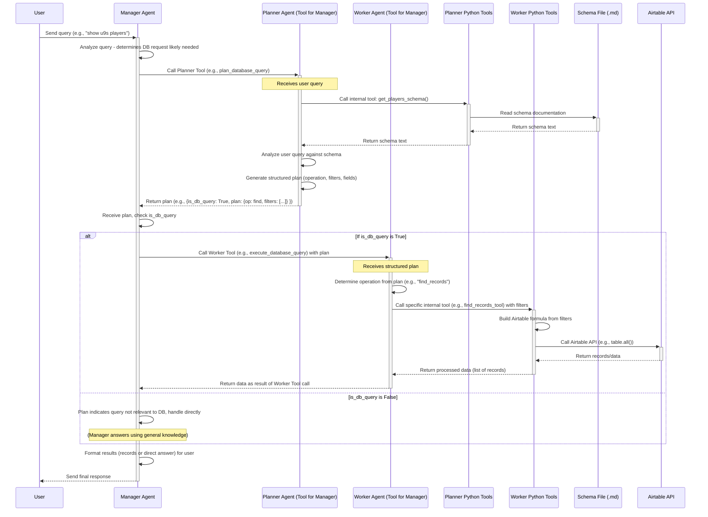

```mermaid
sequenceDiagram
    participant User
    participant ManagerAgent as Manager Agent
    participant PlannerAgent as Planner Agent (Tool for Manager)
    participant WorkerAgent as Worker Agent (Tool for Manager)
    participant PlannerTools as Planner Python Tools
    participant WorkerTools as Worker Python Tools
    participant SchemaFile as Schema File (.md)
    participant AirtableAPI as Airtable API

    User->>+ManagerAgent: Send query (e.g., "show u9s players")
    ManagerAgent->>ManagerAgent: Analyze query - determines DB request likely needed
    ManagerAgent->>+PlannerAgent: Call Planner Tool (e.g., plan_database_query)
    Note over PlannerAgent: Receives user query

    PlannerAgent->>+PlannerTools: Call internal tool: get_players_schema()
    PlannerTools->>+SchemaFile: Read schema documentation
    SchemaFile-->>-PlannerTools: Return schema text
    PlannerTools-->>-PlannerAgent: Return schema text

    PlannerAgent->>PlannerAgent: Analyze user query against schema
    PlannerAgent->>PlannerAgent: Generate structured plan (operation, filters, fields)
    PlannerAgent-->>-ManagerAgent: Return plan (e.g., {is_db_query: True, plan: {op: find, filters: [...]} })

    ManagerAgent->>ManagerAgent: Receive plan, check is_db_query
    alt If is_db_query is True
        ManagerAgent->>+WorkerAgent: Call Worker Tool (e.g., execute_database_query) with plan
        Note over WorkerAgent: Receives structured plan
        WorkerAgent->>WorkerAgent: Determine operation from plan (e.g., "find_records")
        WorkerAgent->>+WorkerTools: Call specific internal tool (e.g., find_records_tool) with filters
        WorkerTools->>WorkerTools: Build Airtable formula from filters
        WorkerTools->>+AirtableAPI: Call Airtable API (e.g., table.all())
        AirtableAPI-->>-WorkerTools: Return records/data
        WorkerTools-->>-WorkerAgent: Return processed data (list of records)
        WorkerAgent-->>-ManagerAgent: Return data as result of Worker Tool call
    else is_db_query is False
        ManagerAgent->>ManagerAgent: Plan indicates query not relevant to DB, handle directly
        Note over ManagerAgent: (Manager answers using general knowledge)
    end
    ManagerAgent->>ManagerAgent: Format results (records or direct answer) for user
    ManagerAgent-->>-User: Send final response

``` 