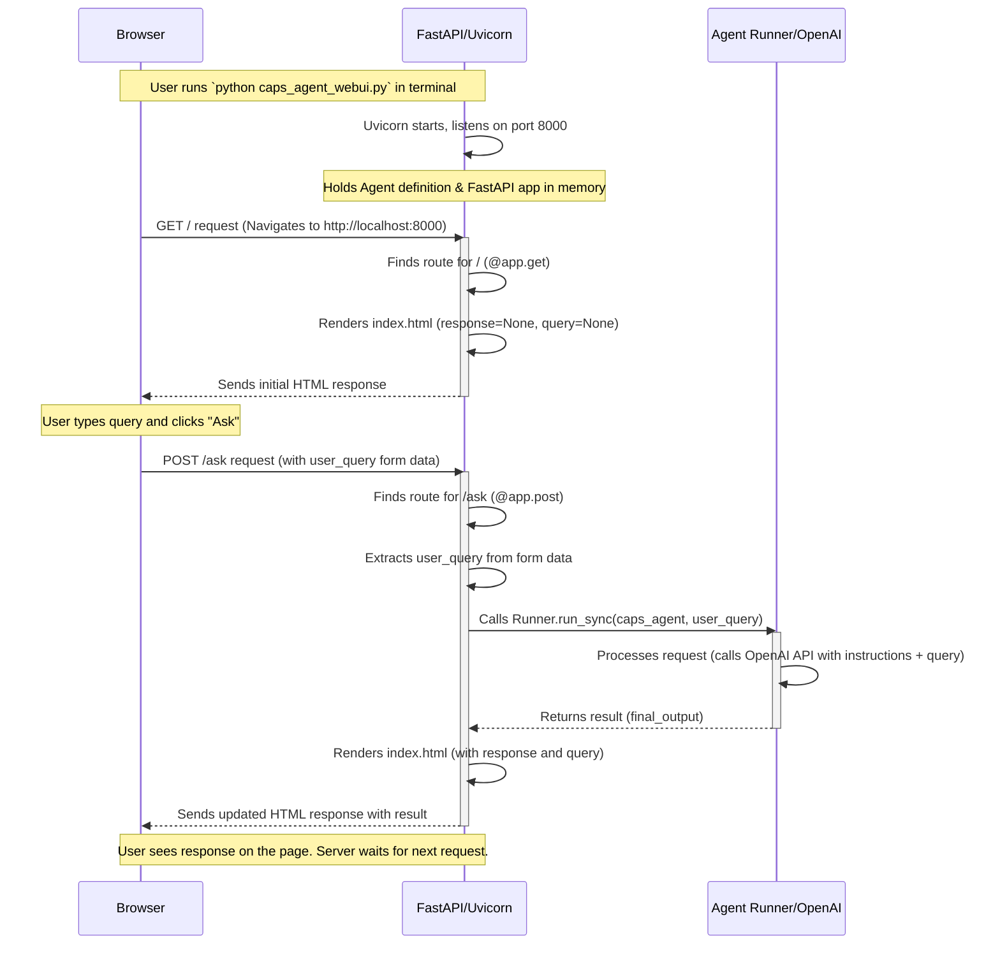

```mermaid
sequenceDiagram
    participant User as Browser
    participant WebServer as FastAPI/Uvicorn
    participant Agent as Agent Runner/OpenAI

    Note over User, WebServer: User runs `python caps_agent_webui.py` in terminal

    WebServer->>WebServer: Uvicorn starts, listens on port 8000
    Note over WebServer: Holds Agent definition & FastAPI app in memory

    User->>WebServer: GET / request (Navigates to http://localhost:8000)
    activate WebServer
    WebServer->>WebServer: Finds route for / (@app.get)
    WebServer->>WebServer: Renders index.html (response=None, query=None)
    WebServer-->>User: Sends initial HTML response
    deactivate WebServer

    Note over User: User types query and clicks "Ask"

    User->>WebServer: POST /ask request (with user_query form data)
    activate WebServer
    WebServer->>WebServer: Finds route for /ask (@app.post)
    WebServer->>WebServer: Extracts user_query from form data
    WebServer->>Agent: Calls Runner.run_sync(caps_agent, user_query)
    activate Agent
    Agent->>Agent: Processes request (calls OpenAI API with instructions + query)
    Agent-->>WebServer: Returns result (final_output)
    deactivate Agent
    WebServer->>WebServer: Renders index.html (with response and query)
    WebServer-->>User: Sends updated HTML response with result
    deactivate WebServer

    Note over User, WebServer: User sees response on the page. Server waits for next request.
``` 